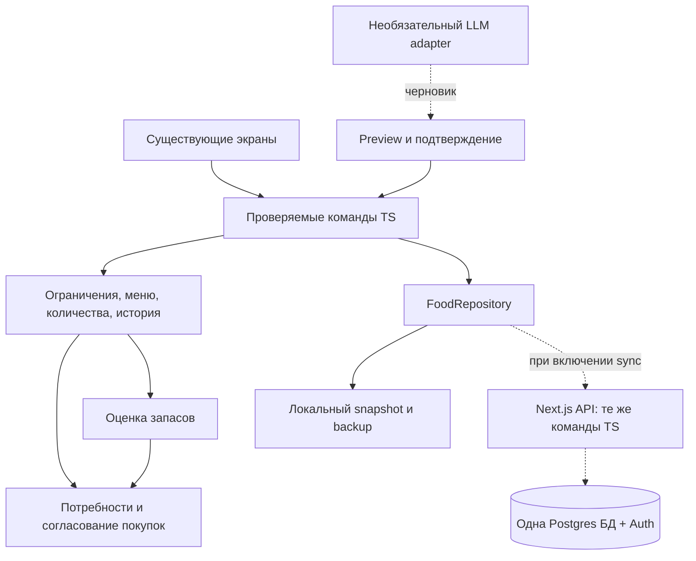

# Целевая архитектура

Статус всех ADR: **proposed**, 2026-09-16. Реализация требует утверждения [master roadmap](../MASTER_ROADMAP.md).

## Target product vs Initial Build

Target product includes Shared Household, evidence-derived Smart Pantry, optional natural-language/voice/image adapters and, much later, a bounded retailer layer. Initial Build ends at `TASK-026`: it remains local-first and proves preferences/restrictions → repertoire → menu → recipes → shopping → actual history. The diagram below shows the eventual boundaries; dotted/conditional nodes must not be scaffolded during Initial Build merely because they exist in the target.

## ADR-01. Один продукт, один TypeScript runtime

Сохранить Next.js App Router, React, Tailwind, текущие UI primitives и Vercel workflow. Доменные модули — обычные TS-функции; сначала вызываются локально, затем при необходимости те же функции работают в серверных Route Handlers. Не переносить planner на Python и не вводить отдельный backend deploy.



`FoodRepository` — узкая граница чтения/записи состояния и подписки, а не универсальная ORM. Не добавлять публичный REST API для каждой внутренней функции: локальным операциям HTTP не нужен. Когда потребуется серверный секрет/общая запись, Route Handlers позволяют оставить API в текущем Next.js приложении. [Next.js: Route Handlers](https://nextjs.org/docs/app/getting-started/route-handlers).

Предлагаемая структура вводится постепенно; пустые каталоги заранее не создавать:

```text
src/app/page.tsx                   композиция существующих экранов
src/features/                     извлечённые AppShell/Today/Menu/Shopping и dialogs
src/components/ui/                существующие primitives
src/lib/types.ts                  существующие DTO, переходная совместимость
src/lib/planner.ts                сохранённый public facade старых функций
src/lib/food/
  ingredients.ts                 ID, aliases, единицы
  constraints.ts                 hard/soft constraints
  recipes.ts                     revision и связь recipe/dish
  planning.ts                    даты, slots, selection, причины выбора
  shopping.ts                    потребности и reconciliation
  history.ts                     действия, наблюдения, исправления
  pantry.ts                      projection и консервативная политика
  commands.ts                    validate → transition → persist
src/lib/storage/                  schema, local repository, migration, backup
src/lib/server/                   только при TASK-028+ / TASK-037+: auth, persistence, adapter
src/app/api/                      только при Shared Household/AI
tests/                           будущие unit/fixtures/integration
e2e/                             будущий browser baseline
```

Не требуются: monorepo/Turborepo, Python/FastAPI, микросервисы, Redis, очереди, event bus, vector DB, MCP в runtime, LangChain, отдельный gateway, GraphQL, отдельный analytics stack. Условие пересмотра — измеренный запрос/нагрузка, который нельзя разумно закрыть текущими модулями, и отдельный ADR.

## ADR-02. Сохранить UX и данные, отделить исправления от рефакторинга

Извлекать по одному экрану, сохраняя DOM/className, callbacks, state lifecycle и доступные действия. Перенос функции в файл не меняет её поведение. Исправления F01–F22 — отдельные PR. Во время `TASK-009`–`TASK-012` текущую навигацию на `/` не переделывать в routes, chatbot-first или новый дизайн. Четырёхпунктовая A2-inspired IA появляется только в отдельном `TASK-013` после утверждения и без копирования design-branch code.

В local-only остаётся работа без сети в уже загруженной странице. Manifest не гарантирует загрузку приложения с нуля offline; offline cold start/service worker — отдельная будущая задача после проверки необходимости. Синхронизированный режим сначала online-first с явным состоянием сохранения; минимальный offline Shopping появляется только в `TASK-030`. Не обещать остальные offline writes без реализованного протокола повторов/конфликтов.

## ADR-03. Версионируемые данные и единая точка записи

После механического repository extraction добавить envelope: `schemaVersion`, `revision`, `data`, `updatedAt`. Чтение schema не генерирует новые записи. `[]` — допустимое значение, а не сигнал «заполни seed». Неизвестная более новая schema открывается без записи до совместимого клиента.

Все изменения проходят: команда → runtime validation → доменные invariants → новый state без мутации исходного → сохранение → уведомление UI. `commit` не вычисляет покупки только по пустоте массива. Конкретные команды определяют, какие производные данные пересчитать. Нет записи из JSX в произвольный `AppState` после завершения `TASK-006`.

Минимальный конверт команды: `commandId`, `expectedRevision`, `type`, `payload`; clock/ID generator передаются явно для тестов. Нормальные UI формы используют те же команды, что будущий AI.

Ошибки типизированы: `invalid_input`, `unknown_ingredient`, `incomplete_recipe`, `constraint_violation`, `no_candidate`, `revision_conflict`, `storage_unavailable`. UI показывает ошибку/нужное уточнение и сохраняет введённый текст, а не сообщение об успехе.

Для одного browser snapshot записывается единым `setItem`; событие не означает транзакцию между вкладками. Для мутаций нужен один writer: Web Lock там, где поддержан, плюс перечитывание revision внутри lock. Без надёжной межвкладочной блокировки второй редактор read-only с явным сообщением. Один `expectedRevision` без lock не решает гонку read-modify-write в localStorage.

Undo сначала хранит проверенную неизменённую предыдущую ревизию. После появления history применяется compensating command; отменённый факт остаётся помеченным, не влияет на projection. После изменения другим устройством whole-state undo не применяется поверх новой ревизии.

## ADR-04. Семейная модель: hard constraints прежде scoring

Профиль ребёнка не обязан быть аккаунтом. `FamilyMember` остаётся eating profile; `User/membership` появятся только в S. Household содержит locale/timezone/currency, но многопользовательский SaaS/tenant model сейчас не строится.

Разделить:

- `hard`: подтверждённый аллерген, исключённый ingredient, явный запрет конкретному человеку/группе, ограничения даты/приёма;
- `soft`: любит/не любит, привычность, разнообразие, дешевле, предпочесть запасы;
- `unknown`: свободная заметка или неполное знание состава; не означает «безопасно».

Старые `restrictions` сохраняются дословно в локальных данных как необработанные записи. Каждую неоднозначную запись нужно уточнить; фраза «без молочного» не проверяется поиском этой фразы в названии рецепта. Category «молочные», где сейчас находятся и яйца, не является аллергенной taxonomy.

Предлагаемый порядок проверки: валидность recipe/version → полнота известных ингредиентов/аллергенов → строгие ограничения едоков → даты/лимиты времени → ранжирование разрешённых кандидатов. Все пути (генерация, ручное планирование, замена, повтор, импорт, AI) используют одну проверку. Если нет кандидата — оставить слот незаполненным и объяснить конфликт; не ослаблять hard rule в fallback.

Временно «детям не ставь рыбу на следующей неделе» хранится со scope дат/группы; это не пожизненный family ban и не вывод о заболевании. У общего блюда проверяются все едоки; отдельная взрослая компонента допустима только с явным назначением. Автоматическое обещание отсутствия перекрёстного загрязнения продукт не делает: текущие recipe records такой информации не содержат.

## ADR-05. Рецепты, единицы и порции — детерминированное основание

`Ingredient` имеет стабильный ID, display name, aliases, form (raw/cooked при необходимости), допустимые размерности и проверенные allergen tags с состоянием unknown. Alias не создаёт автоматически эквивалентность: коровье и кокосовое молоко, сырая и готовая курица, рис и рисовая каша — разные сущности. Неизвестное имя остаётся unresolved, сохраняется raw text.

Количество хранит значение, unit, dimension и статус exact/estimated/unknown. Конвертировать только совместимые единицы: кг↔г, л↔мл; шт суммировать как шт. Не переводить штуки в граммы, пачку в килограммы, ложку в граммы без подтверждённого ingredient-specific коэффициента/pack quantity. Запятая и простые дроби разбираются явно. Неизвестное/0/NaN/отрицательное/Infinity не превращаются в 1.

Расчёт порций: `recipe quantity × planned servings / recipe yield`; хранить достаточную фиксированную точность, округлять только представление/покупную единицу. Не создавать decimal dependency, пока scaled integers/явное правило округления покрывают используемые единицы; правила тестируются на накоплении дробей. Деньги хранить integer minor units.

`DishComponent` сохранить как роль/композиционную ссылку. У `RecipeEntry` появляется revision и состояние completeness. Состав/шаги linked dish для новых планов берутся из соответствующей recipe revision. Старые ID сохраняются таблицей соответствий, не пересоздаются из названия. Для unlinked legacy компонентов создаётся совместимое recipe definition без подмены данных пользователя.

Запланированный слот ссылается на revision; при редактировании рецепта пользователь может обновить будущие слоты через preview. Уже приготовленный слот хранит snapshot/ссылку на прежнюю revision. Не нужно бесконечно дублировать полный каталог на каждое событие — хранить только использованные ревизии.

Seed-рецепты неполны: начинать с 15–25 подтверждённых семьёй записей, сохраняя остальные. Неизвестные allergens/quantity/duration маркируются; неполный рецепт можно хранить как черновик, но нельзя показывать его shopping result как полный и гарантированно удовлетворяющий hard constraints. Batch готовки и остаток связываются позже, когда есть факт готовки.

## ADR-06. План не является фактом; история не является event bus

Сохранить MealPlan как совместимую сущность meal slot; добавить стабильный slot ID независимо от даты, `planId`, status draft/accepted, recipe revision, servings/eater scope. Вводить отдельный небольшой plan metadata record, не переименовывать все текущие сущности в одном PR.

История — обычный массив records локально/JSON в persistent state, позднее при объёме — таблица. Поля: event ID, actor (если есть), happenedAt, recordedAt, тип, slot/recipe/version, источник UI/manual/import, command ID, correctionOf. История не требует очереди, message broker, CQRS или отдельного event-store.

Различать `plan_accepted`, `meal_replaced`, `meal_skipped`, `cooked_confirmed`, `eaten_confirmed`, `liked/disliked`, `purchase_confirmed`, `stock_observed`, `stock_corrected`. `generated` можно записать агрегировано по плану; просмотр экрана/рендер не создаёт повторных events. Удаление семейных данных/экспорт охватывают и history; она не «вечный неизменяемый архив» вопреки воле пользователя.

Старые feedback импортировать как legacy meal feedback с имеющейся датой. Не додумывать состав, точное время, количество и purchase history по нынешнему inventory. В отсутствие надёжной revision старое приготовление не является доказательством расхода текущего recipe.

Learning v1: явные оценки и подтверждённые повторы повышают/снижают score, recency препятствует надоедливым повторам. Замена — сигнал выбора, а не обязательный dislike; причина может быть «нет времени». Нет отзыва → нет отрицательной оценки. Причины рекомендации видимы, персонализацию можно сбросить, strict rules недоступны для переобучения.

## ADR-07. Smart Pantry как осторожная оценка

Сохранить три пользовательских представления inventory / leftovers / freezer. Внутри различать raw ingredient stock и prepared batch. Одна партия при переносе места хранения сохраняет ID и provenance; разморозка не создаёт дополнительное количество и не гарантирует безопасность новым сроком.

Минимальный projection по запасу: ingredient/batch ID, place, `quantityRange` (nullable), `availability` (confirmed_present / likely_present / low / absent / unknown), observedAt, source event IDs, lastCorrectionAt, expiresAt if explicitly known. Внутренняя reliability может быть эвристической; **0.82 нельзя отображать как 82% вероятность без калибровки на наблюдениях**.

Правила v1:

1. Подтверждённая покупка добавляет количество один раз; checkbox сам по себе не подтверждает точный вес покупки. Перед переносом можно поправить реально купленное.
2. Подтверждённая готовка с известной revision/порциями уменьшает расчётный запас согласно составу. Это расчётный расход, который пользователь может исправить; не сенсорное измерение остатка.
3. Прошедший план без подтверждения не списывает продукты. Он может понизить уверенность, если это явно отражено в причине оценки.
4. «Есть» подтверждает наличие, но не граммы. «Мало» — качественная оценка, «нет» — нулевой доступный запас. Количество для вычитания появляется только после явного подтверждения объёма или «этого хватит на данный список».
5. Последняя ручная correction задаёт новую точку отсчёта: старое событие покупки/импорта до неё не воскресит запас. Позднее реальное событие может обновить оценку с учётом времени факта и дедупликации.
6. Прошедший expiresAt исключает запас из автоматического зачёта и вызывает уточнение; система не объявляет пищу безопасной по фото или одной дате. Просрочка не является фактом физического выбрасывания.
7. Unknown/likely-present показывается рядом с потребностью, но по умолчанию не вычитается автоматически. Предложение «возможно уже есть» позволяет одним действием уточнить.
8. При противоречии/расходе больше известного количества остаток не становится отрицательным: нижняя граница 0, верхняя/unknown и предупреждение о расхождении. Не скрывать ошибку простым clamp без provenance.

Пример: нужно 1000 мл; явно подтверждено 400 мл → купить 600 мл. Только «молоко, кажется, ещё есть» → купить 1000 мл, рядом вопрос; не покупать 180 мл из выдуманной вероятности 0.82. Позже интервалы расхода можно калибровать сравнением прогнозов с подтверждёнными остатками; это не требует отдельного ML backend.

Вопросы выбирать по изменению решения о покупке, давности наблюдения и величине неопределённости; при известных ценах учитывать стоимость ошибки. Не требовать отсутствующие цены для работы. Предлагаемый cap: 3 вопроса на одну подготовку списка; отклонённые не повторять до нового значимого сигнала. Аллергии не становятся вероятностным вопросом pantry.

## ADR-08. Список покупок — потребность плюс намерения пользователя

Разделить вычисляемые ingredient requirements, ручные additions и fulfillment. Сохранить видимый привычный список и чекбоксы.

Потребность имеет provenance: plan/slot/recipe revision, порции, canonical ingredient, quantity. Применяется к явно сохранённому периоду и непропущенным/неприготовленным слотам. Выбранный период не сбрасывается при замене блюда. Already-cooked meals не запрашивают исходные ингредиенты снова. Ручные recipe additions имеют собственный ID; явное «добавить ещё» создаёт дополнительную потребность, сетевой повтор той же команды — нет.

Порядок расчёта:

1. Получить потребности выбранных будущих слотов + ручные добавления.
2. Нормализовать совместимые единицы, оставить unresolved строки отдельно.
3. Распределить подтверждённый запас один раз по потребностям в порядке даты; приготовленную партию зачитывать только как соответствующие порции/ингредиент готового блюда.
4. Получить дефицит `max(0, totalNeed − allocatedConfirmedStock)`.
5. Согласовать дефицит с существующими shopping line IDs, отметками и ручными override.

Checked хранит отмеченное количество, а не неограниченный флаг «любое будущее количество куплено». При росте 1 л → 2 л уже отмеченный 1 л сохраняется, дополнительный 1 л остаётся needed. При снижении потребности исполненные записи не удаляются; лишний продукт остаётся купленным запасом. Ручное удаление/«есть дома» сохраняется как осознанное решение для данного списка; при новой дополнительной потребности возможен review, не молчаливое подавление.

Операция «Купленное в запасы»: одним command ID записать purchase fact, обновить stock, закрыть fulfillment. После этого приобретённое учитывается **через stock**, не вычитается второй раз как checked purchase. Пока checked не перенесено, pending fulfilled quantity не дублируется в stock. Повтор клика, reload и retry не прибавляют продукты повторно. Компенсация purchase учитывает последующее потребление и revision; не восстанавливает весь старый snapshot поверх новых действий.

## ADR-09. Бюджет без интеграций магазина

Текущее `low/medium/high → 7/13/22` оставить только как явно грубую подсказку до `TASK-022`, затем показывать честный статус достаточности данных. Не выдавать её за проверку лимита. Полноценные reference prices появляются только в `TASK-041`. Существующая карточка бюджета сохраняется; точность и scope объясняются в ней.

Для v1 можно вручную хранить reference price: ingredient, quantity/unit, integer minor price, currency, observedAt, source manual/receipt. Расчёт отображает сумму известных позиций, coverage и список неизвестных/устаревших. Цена menu consumption отличается от необходимой следующей покупки; в UI выбрать понятный scope «покупки для выбранного периода».

Результат budget check: within_estimate / exceeds_estimate / insufficient_price_data. При неполном покрытии нельзя утверждать «до 300 BYN». При подтверждённых reference prices арифметика детерминированна, но текущая цена магазина всё равно неизвестна. «Сделать дешевле» выбирает допустимые альтернативы и показывает оценку, не обещает гарантию. Полный Price Engine, акции и оптимизация упаковок не нужны для этого шага.

## ADR-10. LLM предлагает, код проверяет и применяет

Без LLM доступны все основные операции. Будущий adapter получает минимальный контекст: ID профилей/ролей без лишних личных заметок, известные ингредиенты/recipes и допустимые commands. Server secret остаётся на сервере. Произвольный SQL, запись AppState, исполнение кода и browser checkout модели не предоставляются.

Пример запроса: «На следующей неделе дети не хотят рыбу, готовить максимум 30 минут, потратить до 300 рублей».

LLM предлагает structured draft: даты следующей недели, группа детей, временное исключение fish, `maxTotalMinutes=30`, `budget=300`, предполагаемые currency/scope. **Код** привязывает даты к timezone семьи, проверяет ID/состав/units, определяет currency, считает бюджет по имеющимся данным, строит preview. Если currency/scope неоднозначны, preview просит уточнение; LLM не выбирает молча денежный смысл.

Стадии: parse → validate schema → resolve IDs → validate constraints → compute deterministic diff → review → execute command against expectedRevision. При изменении состояния после preview требуется новый расчёт. Подтверждение определяется типом действия в коде, не полем `requires_confirmation` от LLM. AI никогда не отменяет установленное строгое ограничение. На первом AI этапе все изменения состояния из natural language проходят preview; обычные однозначные кнопки сохраняют текущую скорость.

Неизвестный запрос → явный ответ «не применено», не ложная заметка. Ошибка, timeout, invalid JSON, prompt injection в рецепте/изображении → никакой записи. Один provider adapter, timeout, ограниченный retry, request ID и счётчик стоимости; второй provider только после конкретной причины. Ввод голоса/фото возвращает тот же draft; фото не доказывает вес, freshness или отсутствие аллергена. Сырые медиа не требуют постоянного Storage по умолчанию.

## ADR-11. Sync только при требовании второго устройства

Рекомендуемый managed-кандидат — Supabase Postgres + Auth, поскольку эти возможности уже связаны с планами репозитория; реальный проект не обнаружен/не подключён. [Официальное руководство Next.js/Auth](https://supabase.com/docs/guides/auth/server-side/nextjs), [grants и RLS](https://supabase.com/docs/guides/database/postgres/row-level-security). Конкретные SDK/настройки повторно проверить при реализации, включая changelog.

Минимальная схема для одной небольшой семьи: `households`, `household_memberships`, `household_state` (versioned JSONB + revision), `command_receipts` (idempotency key, hash, outcome revision). Domain records остаются структурированными и валидируемыми в TS; не создавать 25 пустых реляционных таблиц до их нужности. Для маленького state единый snapshot упрощает атомарность. Цена решения — coarse-grained конфликты/рост JSON; это явный tradeoff.

Переход к отдельным таблицам shopping/history нужен, когда размер state/latency или реальные конфликты измеренно мешают: зафиксировать baseline, ориентир пересмотра — state порядка 1 MB или систематические конфликты обычных двух редакторов. Это не ограничение провайдера. Миграция одной горячей сущности отдельным PR, не новый backend.

В synchronized режиме сервер принимает **команду**, не доверенный клиентский computed state. Сервер проверяет сессию и membership, читает revision, вызывает те же TS rules, атомарно записывает state + receipt с compare-and-swap. Для небольшого числа editors конфликт возвращает 409: перечитать и повторно проверить; не потерять ввод. Повтор request ID с другим payload → reject. Для purchase/consume нельзя безусловно повторять арифметический increment.

Защита: browser read — только свой household через RLS; прямой browser write snapshot запрещён. Серверный persistence путь имеет минимально необходимую роль/приватную транзакционную функцию; actor берётся из проверенной сессии, не из body. Если для транзакции используется server-only service role, она обходит RLS, поэтому membership проверяется **и API, и внутри write function**; вызов функции клиентскими ролями закрыт. Tests проверяют попытку обойти команды прямой Data API записью. Не полагаться только на `authenticated` или переданный household ID.

Первый sync: refetch при focus и bounded polling только видимого shopping screen; ориентир отображения второго изменения ≤5 секунд online. Сначала проверить это с двумя пользователями. Realtime добавить только при недостатке этой схемы; уведомление означает invalidation/refetch, не гарантированную доставку бизнес-команды. Не добавлять обязательный Realtime/server websocket в M0.

Offline synchronized mode: показывать последний snapshot с временем, блокировать неоднозначные durable writes, сохранять несохранённый текст формы локально. В `TASK-030` допускается узкая item-level очередь только для check/uncheck/add Shopping с явным pending state и idempotency key. Не выдавать локальную optimistic отметку за сохранённую сервером. Полноценная общая offline очередь/CRDT остаётся отдельным подтверждённым требованием.

## ADR-12. Миграция и rollback

Local v1 → envelope:

1. Сохранить исходные bytes старого ключа как backup и дать скачать файл.
2. Validate/preview: количество сущностей, ID, ссылки, unresolved поля.
3. Создать новый versioned key; не перезаписывать legacy и не дописывать seed в пользовательские коллекции.
4. Read-back/compare; переключить marker только после успеха. Повтор миграции с тем же input не дублирует данные.
5. При ошибке оставить legacy и понятный режим восстановления. Если места в localStorage не хватает для backup, сначала download; автоматическую destructive миграцию не выполнять.

Local → cloud:

1. Authenticate и выбрать/создать household через подтверждённый flow.
2. Backup + нормализованный snapshot с schema version и import ID.
3. Импорт в **пустой** household атомарно; если там данные — отдельный preview merge/conflict, не replace.
4. Проверить IDs/counts/hash доменных данных и read-back.
5. Явно переключить authority на server; local сохраняется как backup/cache, не второй writer.

Shadow допускает сравнение двух read snapshots, но не независимый dual-write. После server cutover откат UI сохраняет серверную authority и совместимую schema. Возврат к local требует свежего экспорта server state; старый snapshot не актуален. Для schema: expand → read both → write new → проверить → cleanup позже. Деструктивный down migration не является штатным rollback пользовательских данных.

Каждый PR с форматом данных должен указать reader compatibility и backup, каждый PR поведения — regression fixture и доступный revert/flag. Флаг не должен включать старую ошибочную аллергенную проверку: при сбое строгого validator блокируется автоматическое планирование, остаются просмотр/редактирование/экспорт.
